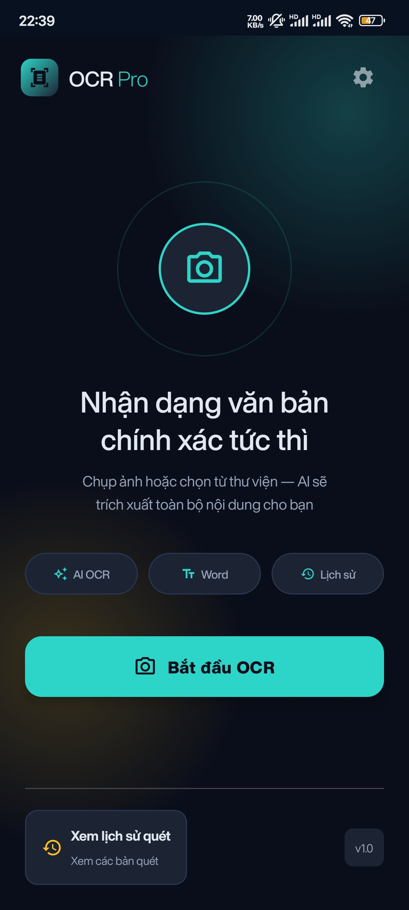
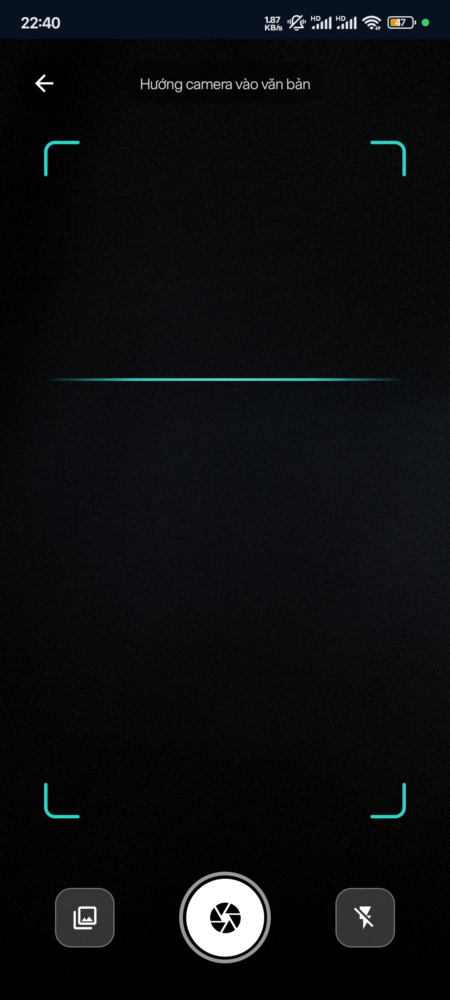
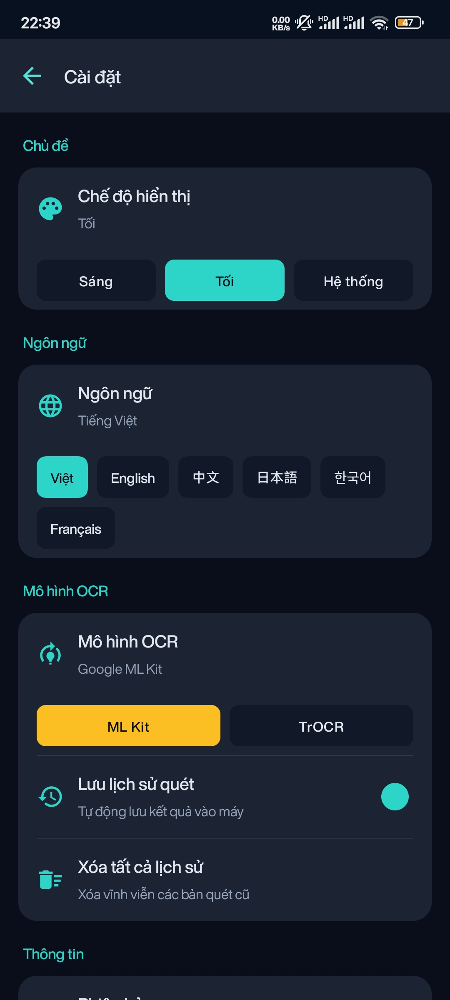

# OCR Pro - Smart Text Recognition

[](https://github.com/khanhd23/OCR-app/actions/workflows/android.yml)

Ứng dụng Android trích xuất văn bản từ ảnh chụp hoặc ảnh trong thư viện. App tiền xử lý ảnh ngay trên thiết bị: phát hiện từng dòng chữ bằng ML Kit, gộp các mảnh dòng bị đứt và nắn phối cảnh từng dòng, sau đó gửi các dòng đã chuẩn hoá lên server để nhận dạng (ML Kit hoặc TrOCR). Kết quả được lưu lại, có thể tìm kiếm, sao chép và xuất ra file Word.

## Ảnh chụp màn hình

<table>
  <tr>
    <th width="33%">Màn hình chính</th>
    <th width="33%">Chụp ảnh</th>
    <th width="33%">Cài đặt</th>
  </tr>
  <tr>
    <td align="center"></td>
    <td align="center"></td>
    <td align="center"></td>
  </tr>
</table>

---

## Tính năng

- **Chụp ảnh / chọn nhiều ảnh:** dùng CameraX (chế độ chất lượng cao) hoặc chọn nhiều ảnh từ thư viện. Mỗi ảnh là một trang.
- **OCR nhiều trang:** hiển thị tiến độ theo từng trang. Nếu một trang lỗi, các trang còn lại vẫn được xử lý.
- **Pipeline tiền xử lý trên thiết bị** (xem bên dưới).
- **Chọn mô hình nhận dạng:** Google ML Kit hoặc TrOCR (xử lý phía server).
- **Lịch sử:** lưu bằng Room, có tìm kiếm theo tiêu đề/nội dung (debounce 300ms) và xoá.
- **Xuất Word (.docx):** server sinh file, app tải về và chia sẻ qua `FileProvider`.
- **6 ngôn ngữ giao diện:** Tiếng Việt, English, Français, 日本語, 한국어, 中文.
- **Theme:** Light / Dark / theo hệ thống, Material 3, Splash Screen API.

## Pipeline nhận dạng

```text
Ảnh gốc
  └─ ImagePreprocessor      tăng tương phản (ColorMatrix)
      └─ ML Kit             phát hiện các dòng chữ + 4 góc của mỗi dòng
          └─ LineGeometry   lọc nhiễu → bỏ box nằm lọt trong box khác
                            → gộp mảnh cùng dòng (kể cả dòng nghiêng)
                            → sắp xếp theo thứ tự đọc
              └─ Perspective warp từng dòng (Matrix.setPolyToPoly)
                  └─ Upload batch JPEG các dòng → server OCR → text
```

Nếu ở kích thước gốc không phát hiện được dòng nào, ảnh được phóng to 2x rồi thử lại. Logic hình học nằm trong [`LineGeometry`](app/src/main/java/com/example/ocr/data/local/processor/LineGeometry.kt), viết bằng Kotlin thuần (không phụ thuộc Android) nên chạy unit test được trên JVM.

---

## Tech Stack

| Hạng mục | Công nghệ |
| --- | --- |
| Ngôn ngữ | Kotlin, Coroutines, Flow |
| UI | Jetpack Compose, Material 3, Navigation Compose |
| Kiến trúc | Clean Architecture (data / domain / presentation) + MVVM, `StateFlow` |
| DI | Hilt |
| Camera & Vision | CameraX, Google ML Kit Text Recognition |
| Lưu trữ | Room (lịch sử), DataStore Preferences (cài đặt) |
| Network | Retrofit, OkHttp (multipart upload, tải file) |
| Test | JUnit4, MockK, kotlinx-coroutines-test |
| CI | GitHub Actions (unit test + build APK) |

## Cấu trúc dự án

```text
com.example.ocr/
├── core/           # DI modules, network, constants, extensions
├── data/
│   ├── local/      # Room DB, image processors (ML Kit, LineGeometry, packer)
│   ├── remote/     # DTO + mapper
│   └── repository/ # Repository implementations
├── domain/         # Models, repository interfaces, use cases
└── presentation/   # Compose screens + ViewModels, navigation, theme
```

---

## Chạy dự án

1. Yêu cầu Android Studio Ladybug (2024.2.1) trở lên, JDK 17, thiết bị/emulator API 24+.
2. Clone:
   ```bash
   git clone https://github.com/khanhd23/OCR-app.git
   ```
3. Cấu hình địa chỉ server OCR trong `local.properties` (file này không commit lên git):
   ```properties
   ocr.baseUrl=http://192.168.1.10:8000/
   ```
   Nếu bỏ trống, mặc định là `http://10.0.2.2:8000/` (tức localhost của máy host khi chạy trên Android Emulator). HTTP thường chỉ được phép ở bản debug.
4. Build & Run. Chạy test:
   ```bash
   ./gradlew :app:testDebugUnitTest
   ```

### API server cần cung cấp

| Endpoint | Request | Response |
| --- | --- | --- |
| `POST api/ocr/batch` | multipart: `lines[]` (JPEG), `page_index`, `model` (`mlkit` / `trocr`) | `{ success, pageIndex, total, results: [string], message }` |
| `POST api/export/word` | JSON `{ filename, content: [string] }` | file `.docx` |

---

## Điểm kỹ thuật

- Gộp các mảnh dòng nghiêng bằng cách so cao độ mép phải của mảnh trái với mép trái của mảnh phải, thay vì chỉ so độ chồng lấn của bounding box.
- Recycle Bitmap ngay sau khi nén JPEG / khi đổi ảnh để tránh OOM khi xử lý nhiều trang.
- Các màn hình OCR, kết quả, lịch sử đi qua tầng UseCase; ViewModel và logic hình học có unit test.
- Chỉ log request/response khi chạy bản debug; URL server cấu hình qua `BuildConfig`.
